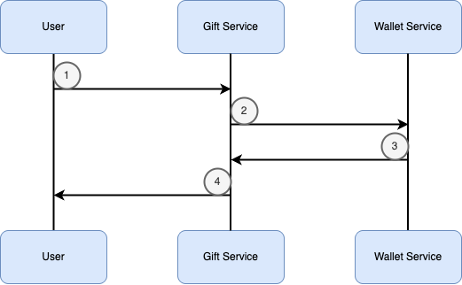

# Project API Documentation

This documentation describes all endpoints for the GiftCode/Discount Service and Wallet Service, including request and response formats, error codes, and data types.
The workflow is illustrated in the flow diagram below.

---

## Workflow Diagram



---

## 1️⃣ GiftCodeService

### 1.1 Redeem Gift Code

**Description:**
User submits phone number and gift code. Gift Service validates the code, registers the user if eligible, and instructs Wallet Service to credit the account.

**Endpoint:**

```
Name:   redeemGiftCode
Method: POST
Url:    http://localhost:8080/gift/redeem
Headers: no content
Body:
{
    "phone_number": "string",   // User's phone number
    "gift_code":  "string"      // Gift code input
}
Errors:
- code: 400
  Name: Bad Request
  Body:
  {
      "error": "invalid input data"
  }
- code: 409
  Name: Conflict
  Body:
  {
      "error": "phone already used or limit exceeded"
  }
- code: 500
  Name: Internal Server Error
  Body:
  {
      "error": "server failed to process request"
  }
Response:
- code: 200
  Name: Success
  Body:
  {
      "message": "user registered as winner",
      "position": (int)    // User's position among first 1000
  }
```

---

### 1.2 Get Gift Code Report

**Description:**
Admin/system retrieves a list of users who redeemed a specific gift code.

**Endpoint:**

```
Name:   getGiftCodeReport
Method: GET
Url:    http://localhost:8080/gift/report/:code
Headers: no content
Body:   no content
Errors:
- code: 404
  Name: Not Found
  Body:
  {
      "error": "gift code not found"
  }
- code: 500
  Name: Internal Server Error
  Body:
  {
      "error": "unable to fetch report"
  }
Response:
- code: 200
  Name: Success
  Body:
  [
      {
          "phone_number": "string",
          "redeemed_at": "time.Time",
          "status": "credited"
      }
  ]
```

---

## 2️⃣ Wallet Service

### 2.1 Get Wallet Info

**Description:**
User requests current wallet balance and last transaction information.

**Endpoint:**

```
Name:   getWalletInfo
Method: GET
Url:    http://localhost:9898/wallet/:phone
Headers: no content
Body:   no content
Errors:
- code: 400
  Name: Bad Request
  Body:
  {
      "error": "invalid phone number"
  }
- code: 404
  Name: Not Found
  Body:
  {
      "error": "user wallet not found"
  }
- code: 500
  Name: Internal Server Error
  Body:
  {
      "error": "failed to retrieve wallet"
  }
Response:
- code: 200
  Name: Success
  Body:
  {
      "balance": (int),
      "last_transaction": "time.Time"
  }
```

---

### 2.2 Add Credit

**Description:**
Gift Service requests Wallet Service to credit a user's wallet.

**Endpoint:**

```
Name:   addCredit
Method: POST
Url:    http://localhost:9898/wallet/credit
Headers: no content
Body:
{
   "phone_number": "string",   // User's phone number
   "amount": (int),            // Credit amount
   "reference": "string"       // Source of credit (e.g., gift code)
}
Errors:
- code: 400
  Name: Bad Request
  Body:
  {
      "error": "invalid input"
  }
- code: 500
  Name: Internal Server Error
  Body:
  {
      "error": "failed to update wallet"
  }
Response:
- code: 200
  Name: Success
  Body:
  {
      "message": "credit added successfully",
      "new_balance": (int)
  }
```